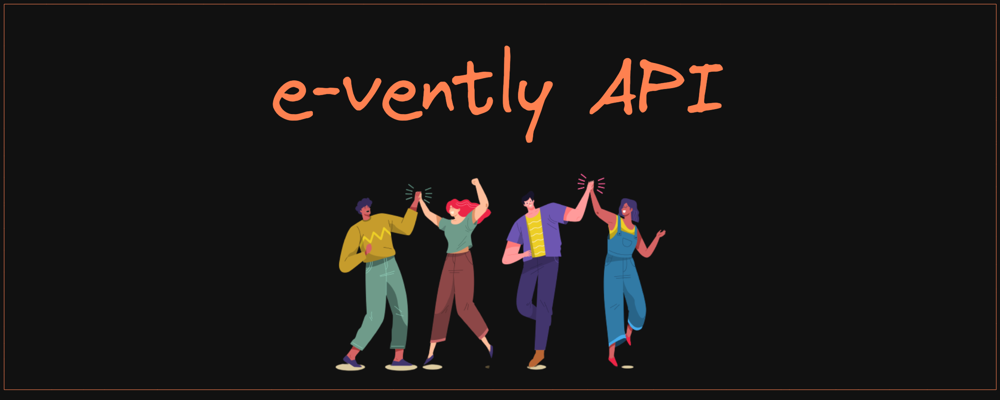

# Projeto API de Eventos :ticket:

 

<h2>Índice</h2>

 :round_pushpin: [Sobre](#sobre) 
 :round_pushpin: [Tecnologias](#tecnologias) 
 :round_pushpin: [Decisões](#decisoes) 
 :round_pushpin: [Orientações](#orientacoes) 
 :round_pushpin: [Scripts](#scripts) 
 :round_pushpin: [Testes](#testes) 
 :round_pushpin: [Usabilidade](#usabilidade) 
 :round_pushpin: [Documentação](#documentacao) 
